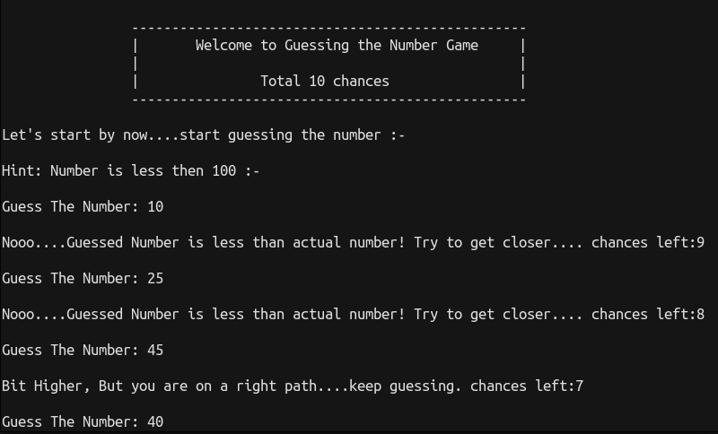
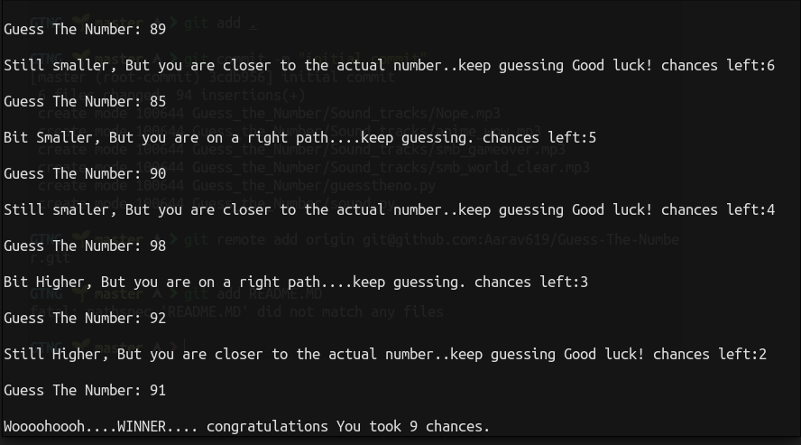

# Guess The Number

A simple CLI based game built using python.

## Requirements
Python 
Modules: Playsound,Random
## Installation

Install playsound with pip

```bash
  pip install playsound
```
For python version older than 3.x install Random

```  
  pip install random
```
## Usage

```bash
  git clone https://github.com/Aarav619/Guess-The-Number.git
  cd Guess-The-Number && python3 guesstheno.py
```


## Screenshots






